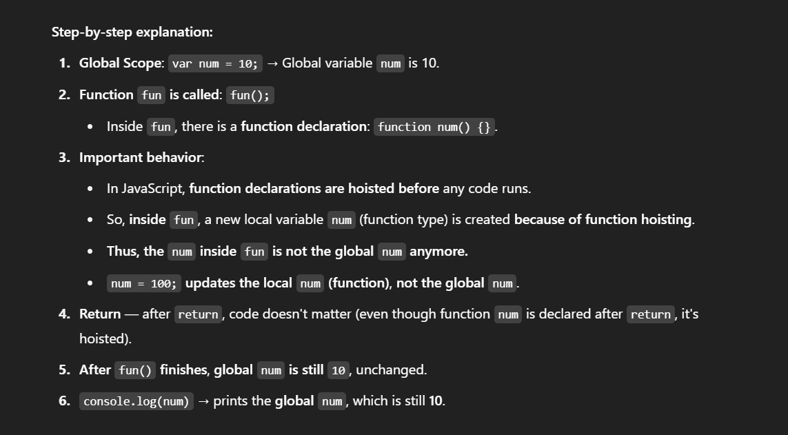
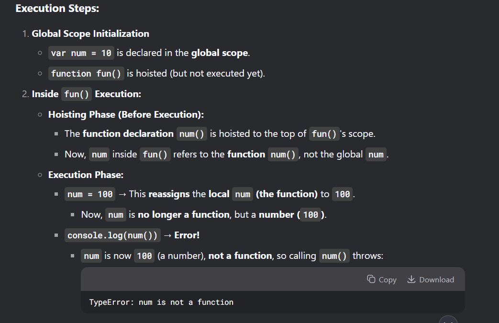

```var num = 10;

function fun() {
    num = 100;
    return;
    function num() {}  // function declaration inside fun
}

fun();
console.log(num);
```



```
var num = 10;

function fun() {
    num = 100;
    function num() {
        return num;
    }
    console.log(num());  // Error: num is not a function
}

```



------------------------------------------------------------------------------------------------------------
```
var num = 10;

function fun() {
    num = 100;
    function num1() {
        return num;
    }
    
    console.log(num1()); 
}


  console.log(fun()); 

````

```
  // 100
  ```
  ```
  // undefined
  ```

